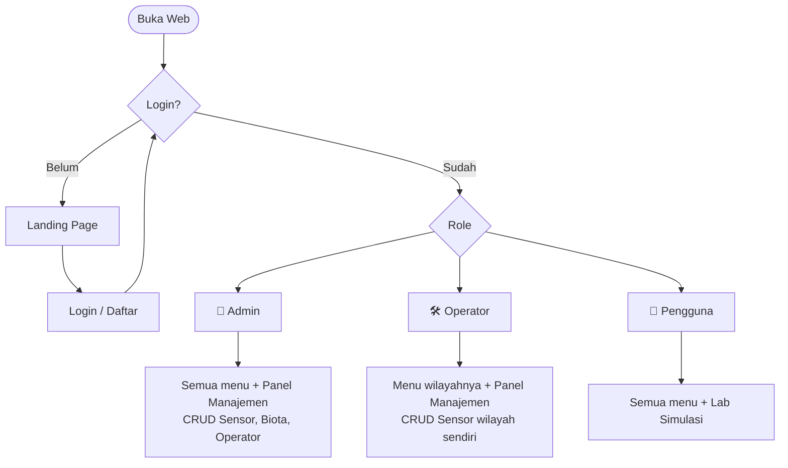
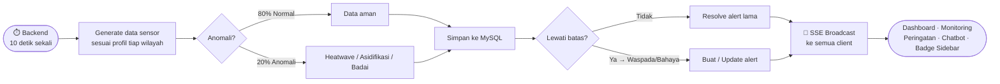
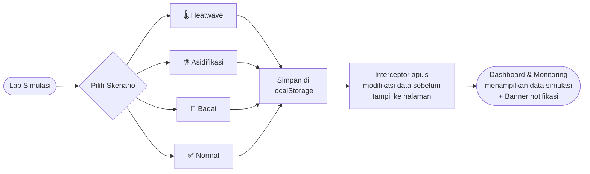
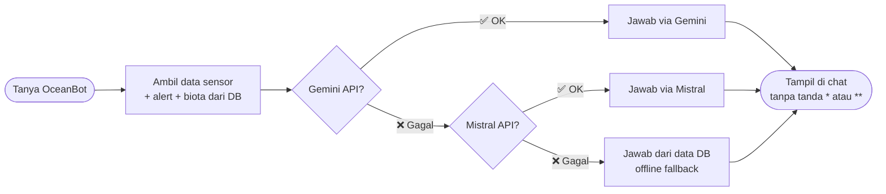
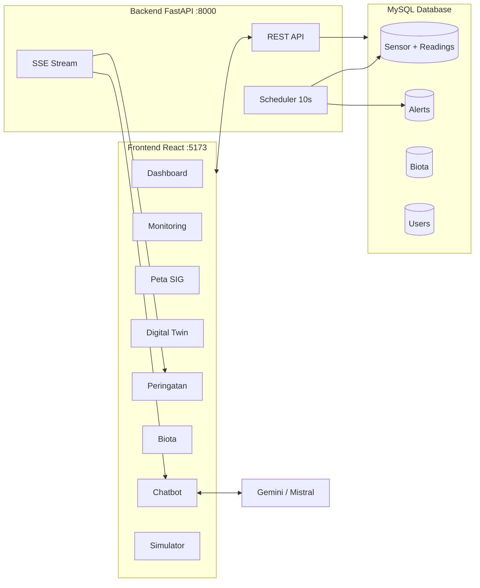

# 🌊 Diagram Alur Sistem OceanSmart

## Alur Utama

```mermaid
flowchart TD
    A([Buka Web]) --> B{Login?}
    B -- Belum --> C[Landing Page]
    C --> D[Login / Daftar]
    D --> B
    B -- Sudah --> E{Role}

    E --> F[👑 Admin]
    E --> G[🛠️ Operator]
    E --> H[👤 Pengguna]

    F --> I[Semua menu + Panel Manajemen\nCRUD Sensor, Biota, Operator]
    G --> J[Menu wilayahnya + Panel Manajemen\nCRUD Sensor wilayah sendiri]
    H --> K[Semua menu + Lab Simulasi]
```

---

## Alur Data Real-Time

```mermaid
flowchart LR
    A([⏱️ Backend\n10 detik sekali]) --> B[Generate data sensor\nsesuai profil tiap wilayah]
    B --> C{Anomali?}
    C -- 80% Normal --> D[Data aman]
    C -- 20% Anomali --> E[Heatwave / Asidifikasi / Badai]
    D & E --> F[Simpan ke MySQL]
    F --> G{Lewati batas?}
    G -- Tidak --> H[Resolve alert lama]
    G -- Ya → Waspada/Bahaya --> I[Buat / Update alert]
    H & I --> J[📡 SSE Broadcast\nke semua client]
    J --> K([Dashboard · Monitoring\nPeringatan · Chatbot · Badge Sidebar])
```

---

## Alur Simulasi (Pengguna)

```mermaid
flowchart LR
    A([Lab Simulasi]) --> B{Pilih Skenario}
    B --> C[🌡️ Heatwave]
    B --> D[⚗️ Asidifikasi]
    B --> E[🌊 Badai]
    B --> F[✅ Normal]
    C & D & E & F --> G[Simpan di\nlocalStorage]
    G --> H[Interceptor api.js\nmodifikasi data sebelum\ntampil ke halaman]
    H --> I([Dashboard & Monitoring\nmenampilkan data simulasi\n+ Banner notifikasi])
```

---

## Alur Chatbot OceanBot

```mermaid
flowchart LR
    A([Tanya OceanBot]) --> B[Ambil data sensor\n+ alert + biota dari DB]
    B --> C{Gemini API?}
    C -- ✅ OK --> D[Jawab via Gemini]
    C -- ❌ Gagal --> E{Mistral API?}
    E -- ✅ OK --> F[Jawab via Mistral]
    E -- ❌ Gagal --> G[Jawab dari data DB\noffline fallback]
    D & F & G --> H([Tampil di chat\ntanpa tanda * atau **])
```

---

## Arsitektur Singkat

```mermaid
graph LR
    subgraph FE [Frontend React :5173]
        D[Dashboard]
        M[Monitoring]
        P[Peta SIG]
        DT[Digital Twin]
        AL[Peringatan]
        BI[Biota]
        CH[Chatbot]
        SIM[Simulator]
    end

    subgraph BE [Backend FastAPI :8000]
        API[REST API]
        SCH[Scheduler 10s]
        SSE[SSE Stream]
    end

    subgraph DB [MySQL Database]
        S[(Sensor + Readings)]
        A[(Alerts)]
        B[(Biota)]
        U[(Users)]
    end

    FE <--> API
    SCH --> S & A
    SSE --> AL & CH
    API --> DB
    CH <--> GEM[Gemini / Mistral]
```
